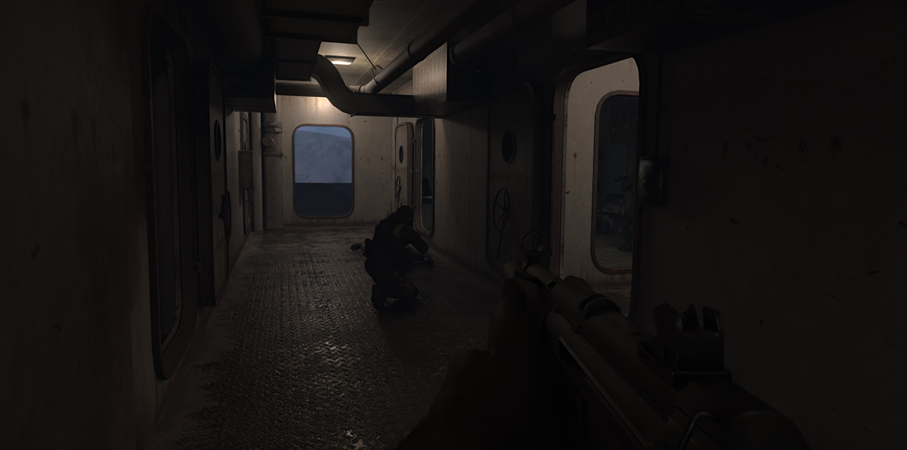
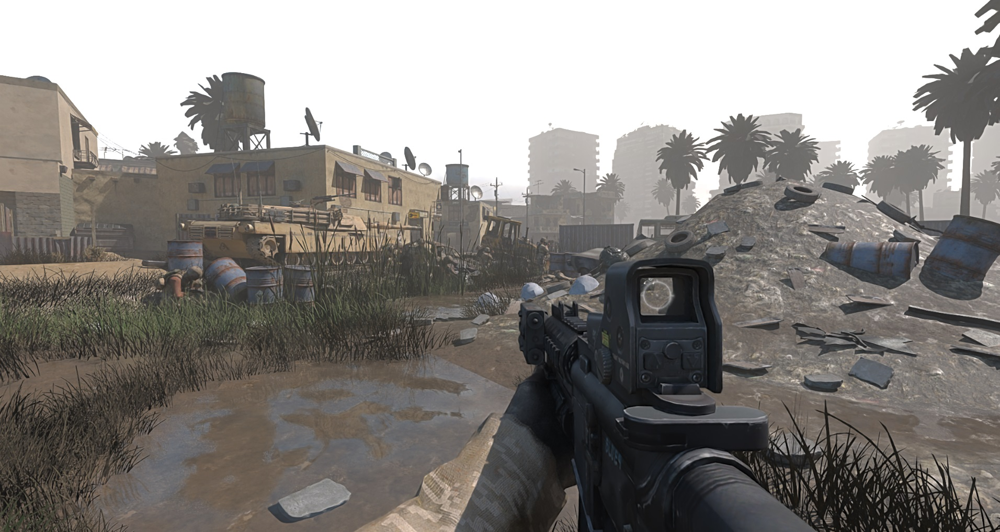
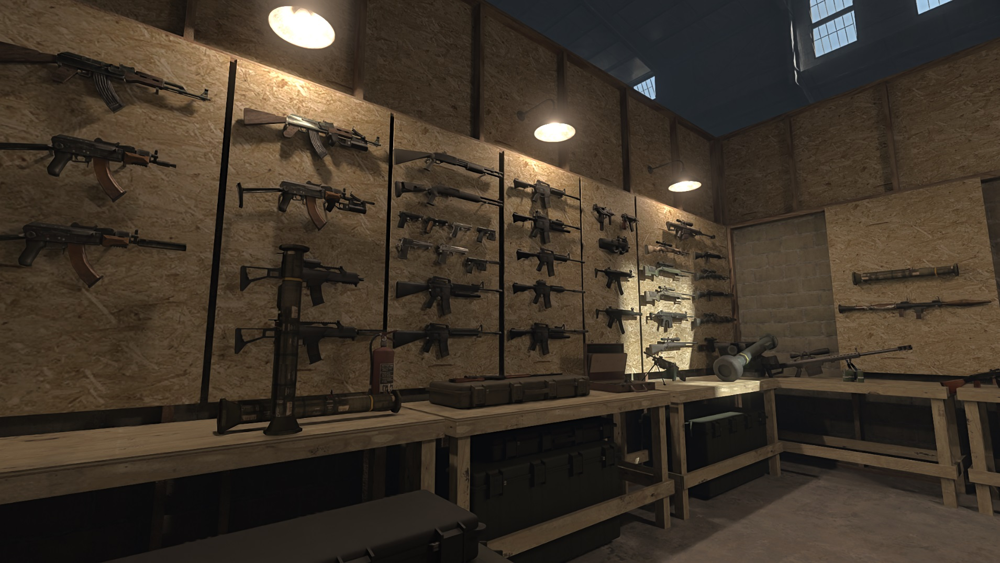
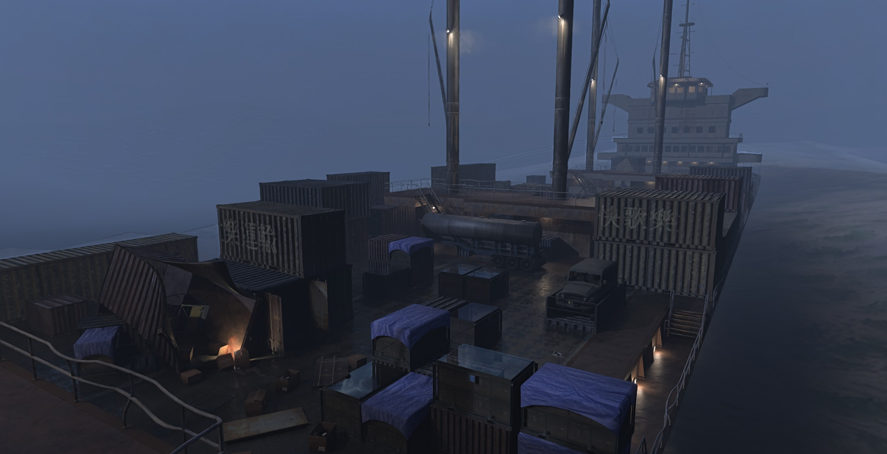

 

&ensp;

# iw3sp-mod-rtx - nvidia RTX Remix compatibility mod

 

This fork of the singleplayer client modification ([iw3sp_mod](https://gitea.com/JerryALT/iw3sp_mod)) for Call of Duty 4: Modern Warfare (IW3)  
makes the game compatible with nvidia's [rtx-remix](https://github.com/NVIDIAGameWorks/rtx-remix). The client is originally based on the [IW4x Client](https://github.com/iw4x/iw4x-client)  

 

# Usage

#### Easy Install:
  1. Download the latest [iw3sp-mod-rtx release](https://github.com/xoxor4d/iw3sp-mod-rtx/releases)
  - Extract the contents into your cod4 root directory.  
  - Skip to Step 5 if you are not interested in nightly builds (featuring the latest changes)

#### Nightly (always up-to-date):

1) Install the latest full release (step above)

2) [rtx only] [optional] Install the latest full rtx-remix release (0.5.1 at this time)   
https://github.com/NVIDIAGameWorks/rtx-remix/tags

 

3) [rtx only] [optional] Install the latest `github action` builds of:  
remix bridge - https://github.com/NVIDIAGameWorks/bridge-remix/actions  
remix runtime - https://github.com/NVIDIAGameWorks/dxvk-remix/actions  

 

4) Download the latest iw3sp-mod-rtx `github actions` build:  
  `Release-binaries-rtx` - https://github.com/xoxor4d/iw3sp-mod-rtx/actions  
  - Drop `game.dll` and the contents of the `assets-remix` folder into your cod4 root directory and start the game.

 

5) Run `iw3sp_mod.exe` to start the game
  
 

6) Read the `Dvars / Console Commands` and `Current issues` sections

 
 

# Remix section

🔷 To clarify, this client mod is only making CoD4 compatible with remix. 🔷  

My actual remix-mod with enhanced materials, meshes and lights can be found over at ModDB:   
[https://www.moddb.com/mods/cod4-mp-rtx-remix-iw3xo](https://www.moddb.com/mods/cod4-mp-rtx-remix-iw3xo)

(the `rtx-remix` directory contains small and simple sp-specific changes that are not part of the ModDB release)
(read the included README)

 

- A. Commandline Arguments:  

  - `-no_rtx` :: disable rtx modules
  - `-no_default_sky` :: disable sky spawning (map settings)
  - `-no_sun` :: disable sun spawning (map settings)
  - `-no_fog` :: disable fog (map settings)
  - `-stock_effects` :: render effects using shaders
  - `-no_forced_lod` :: do not set `r_forceLod` to `high` by default  
  - `-load_normal_spec` :: enable loading of specular and normal maps (if you need to for some reason)

> - commandline example: &ensp;`c:\path\iw3sp_mod.exe -no_forced_lod -no_fog` 

 

- B. Dvars:

	🟩 encouraged to be tweaked  
	🟦 can be useful in edge case scenarios  
	🟧 shouldn't be touched 

	#### Culling dvars:
	🟩 `rtx_culling_tweak_mins` :: prevents a bit of culling  
	🟩 `rtx_culling_tweak_maxs` :: prevents a lot of culling  
	🟩 `rtx_culling_tweak_frustum` :: disables frustum culling  
	🟩 `rtx_culling_tweak_smodel` :: disables static model culling  
	🟩 `rtx_culling_plane_dist` :: distance of frustum culling planes  

	#### General dvars:
	🟩 `r_forceLod` :: force all models to a specific LOD  
	🟩 `r_forceLod_second_lowest` :: prevent game from using the lowest LOD (sometimes used to hide the model)  
	🟩 `r_lodScaleRigid` :: adjust static model draw distances (lower values increase draw distance)  
	🟩 `r_showTess` :: draws material info (incl. all image names) of surfaces (geometry / models)  
	🟩 `r_showCellIndex` :: show portal index info (useful for manual culling overrides via map settings)  
	🟩 `r_showModelNames` :: draw names of static models around the player  

	#### Dvars that should only be changed if you know what you are doing: 
	🟧 `rtx_extend_smodel_drawing` :: disable static model draw limit (max amount of static models drawn at once)  

 

- C. Console Commands :
	- `mapsettings_update` :: reload map settings
	- `mapsettings_get_defaults` :: prints sun direction, color and intensity in map_settings format based on the stock map settings to the consle

#### map_settings.ini :: `root/iw3sp_data` 

🔸 Tweak sunlight / color, skybox and fog settings   
🔸 Override culling per portal / cell (to fix light or shadow culling - dvar `r_showCellIndex`)   
🔸 Spawn unique anchor meshes that can be used to attach unique prims and lights to  

 

## ⚠️ Current Issues
- Swift changes in geometry (eg. teleporting) can crash the game.
  - Decrease geometry drawing by increasing culling or play with `r_lodScaleRigid`

- Remix might try to use your onboard gpu (that is a general CoD issue), so its best to disable it in the bios or within the device manager 

- Some effects will slow down the game (really depends on the effect and the amount)   

 

 

### Questions? 
> visit the [rtx-remix showcase](https://discord.gg/j6sh7JD3v9) discord and check out the cod4 thread (`remix-projects` channel)
- join the [iw3xo](https://discord.gg/t5jRGbj) discord if you have questions related to this modification
- join the [iw3sp-mod](https://discord.gg/YzNZSEMAnf) discord if you have questions related to iw3sp_mod

 

# Credits rtx fork
- [people of the showcase discord](https://discord.gg/j6sh7JD3v9) (for testing, feedback and ideas)
- [nvidia - rtx-remix](https://github.com/NVIDIAGameWorks/rtx-remix)

 
 

# IW3SP_MOD Features
[Mod compatibility list](https://gitea.com/JerryALT/iw3sp_mod/wiki/Mod-Compatibility)

- Increased asset limits for IW3
  - FX: 1200
  - Image: 7168
  - Loaded Sound: 2700
  - Streamed Sound: 24000
  - Material: 8192
  - Weapon: 2400
  - Xmodel: 5125
- Added game achievements;
- Added gamepad support with aim assist;
- Added custom methods and functions for GSC;
- Added loading of additional .ff files `[level name]_patch.ff`;
- Added FOV logic from multiplayer to singleplayer;
- Added map entities editing for the stock maps and [more (Wiki)](https://gitea.com/JerryALT/iw3sp_mod/wiki/IW3SP-MOD%3A+Features)

 

# How to install modification? (For regular users)
1. Download the latest [release](https://github.com/xoxor4d/iw3sp-mod-rtx/releases/latest)
2. Place the .zip contents into your cod4 root folder
3. Start **iw3sp_mod.exe**

 

# How to compile from source? (For advanced users)
1. Clone this repository. I recommend using [git-scm](https://git-scm.com/downloads).
 P.S: (**Downloading the zip does not include deps!**) 
2. Find any directory which you want the placed the content of repository, then open context menu and find "Git Bash Here" and write next line in the cmd: `git clone https://github.com/xoxor4d/iw3sp-mod-rtx.git`
3. After cloning click the generate.bat and wait when all files will be ready.
4. Open build folder and find the iw3sp_dev.sln file and compile.

# Credits iw3sp_mod
- [Jerry4LT - IW3SP_Mod](https://github.com/JerryALT/iw3sp_mod)
- [Bogdan Konstantinou](https://www.youtube.com/@BogdanKonstantinou)
- [xoxor4d - IW3xo](https://github.com/xoxor4d/iw3xo-dev)
- [X Labs Team](https://github.com/XLabsProject)
- [AlterWare](https://github.com/alterware)
- [fed - h2-mod](https://github.com/fedddddd/h2-mod)
- [Nukem9 - LinkerMod](https://github.com/Nukem9/LinkerMod)
- [CoD4X Server/Client](https://github.com/callofduty4x)
- [Vlad Loktionov](https://www.youtube.com/@ruvlad)

## [Dependencies]
- [ocornut - Dear ImGui](https://github.com/ocornut/imgui)
- [curl](https://github.com/curl/curl)
- [juliettef - imgui_markdown](https://github.com/juliettef/imgui_markdown)
- [discord-rpc](https://github.com/discord/discord-rpc)
- [nlohmann - json](https://github.com/nlohmann/json)
- [DirectX SDK](https://github.com/devKlausS/dxsdk)
- [LibTomCrypt](https://github.com/libtom/libtomcrypt)
- [LibTomMath](https://github.com/libtom/libtommath)

# Disclaimer
This software has been created purely for the purposes of academic research. Project maintainers are not responsible or liable for misuse of the software. Use responsibly.
